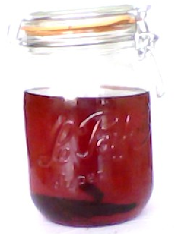
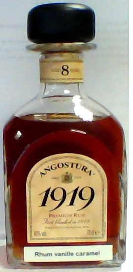

Rhum arrangé caramel vanille
============================

Ingrédients
-----------

- Sirop de sucre de canne (10 cl)
- Caramel (nappage ou autre, 10 cl)
- 2 gousses de vanilles
- Rhum (St james paille 40° ou ambré 45°, 75cl)

Réalisation
-----------
- Mélanger le sirop de sucre de canne, le caramel et le rhum pour obtenir un mélange homogène. Gouter et ajuster les ingrédients (les proportions étant indiquées à titre indicatives).
- Fendre les gousses de vanilles sur toutes leurs longueurs, puis les ajouter à la préparation. Mélanger pour que les grains de vanille se diffuse dans le rhum.
- Laisser macérer.

Temps de macération estimé à 6 mois.

Goûter périodiquement après 3 mois et ajuster le mélange au besoin. Si la vanille a suffisemment diffusé, la macération peut être plus rapide.

Astuces
-------

Pour les impatients, utililiser de l'extrait de vanille pour avoir un rhum arrangé immédiatement à la place des gousses de vanille.

***Après 5 mois de macération :***

