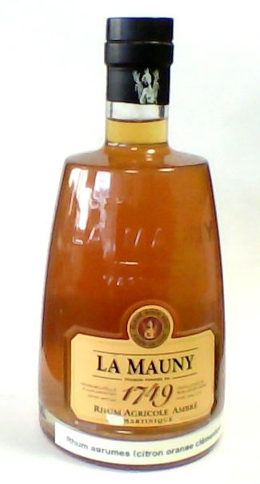

Rhum arrangé orange citron clémentine
=====================================

Ingrédients
-----------

- Sirop de sucre de canne (10 cl)
- Rhum (St james paille 40° ou ambré 45°, 75cl)
- Une orange
- Un citron
- Trois clémentines

Réalisation
-----------
- Peler les fruits et séparer les quartiers en enlevant au maximum la peau blanche.
- Mettre les fruits et ajouter le sirop de sucre de canne et le rhum.
- Laisser macérer.

Temps de macération estimé à 1.5 à 2 mois.

Goûter périodiquement après 1 mois et ajuster le mélange au besoin. Si le rhum est suffisamment aromatisé, retirer les fruits et mettre en bouteille.

Astuces
-------

Si les fruits ne rendent pas assez de parfums, il suffit de les percer lors de la macération.

***Après 45 jours de macération :***

