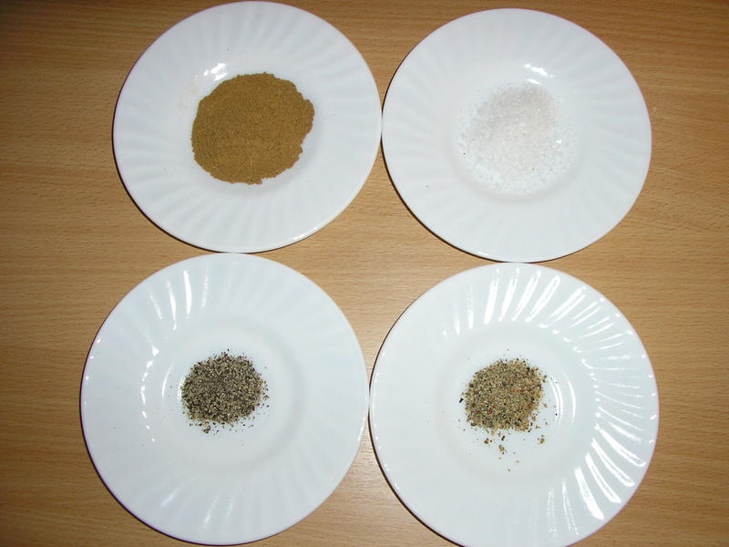
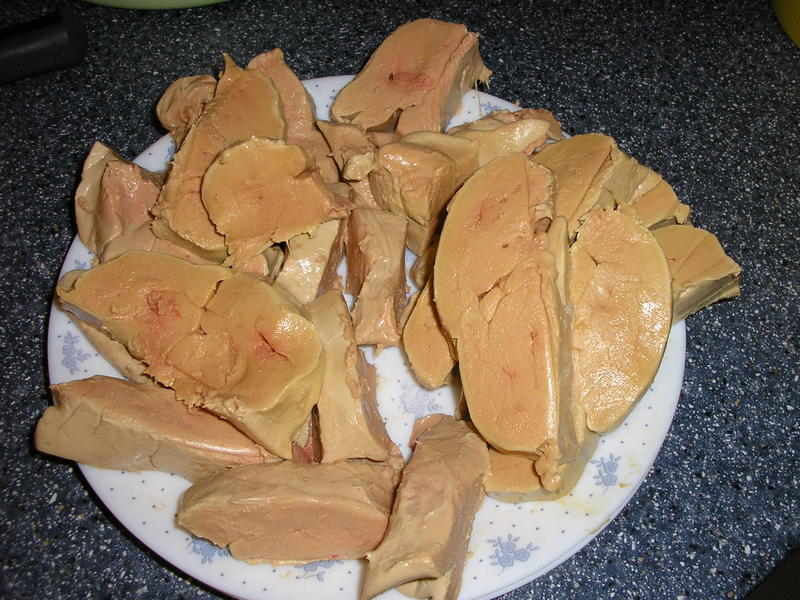
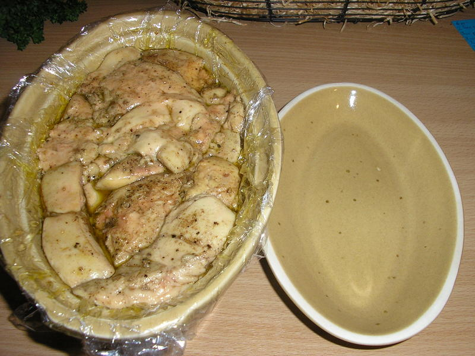
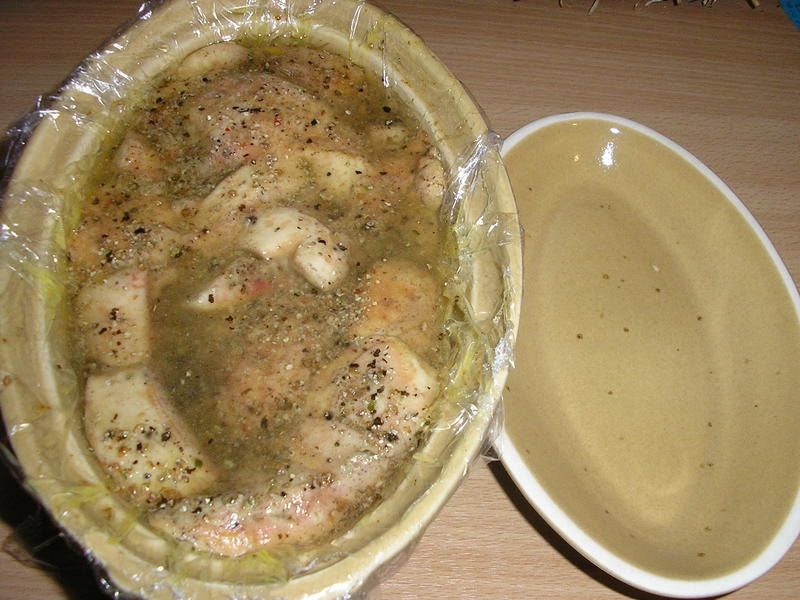

Terrine de foie gras aux épices de pain d'épice
===============================================

_Avant propos :_ désolé pour la qualité des photos (et même de la terrine), elles datent
d'il y a 6 ans ! Elle était bien mieux réussie il y a quelques semaines mais je n'ai
pas pris de photos.

Ingrédients
-----------

- 2 foies gras de canard, environ 500g chacuns
- 3 cuillères à café d'épices de pain d'épice
- 2 cuillères à café de fleur de sel
- 2 cuillères à café de poivre noir
- 2 cuillères à soupe de gros sel
- 2 feuilles de gélatine
- 1 cuillère à café de poivres mélangés (noir, blanc, baies roses)

Réalisation
-----------

### Préparation des foies

- Placer les foies dans un saladier et ajouter le gros sel
- Couvrir d'eau très froide et laisser reposer une heure de temps
- Après une heure, égoutter et éponger les foies
- Les couper en tranches d'1,5 cm tout en les déveinant

### Cuisson

- Filmer une terrine
- Mélanger dans une assiette les épices, la fleur de sel et le poivre noir
- Tourner rapidement les morceaux de foie dans le mélange et les passer dans une poêle
  1 minute de chaque côté. Le feu doit être vif mais veillez tout de même à ne pas
  trop cuire les morceaux, il ne s'agit pas de le faire fondre intégralement.
- Placer les morceaux dans la terrine après les avoir récupéré à l'aide d'une écumoire
- Tasser légèrement et laisser refroidire

### Finition

- Faire tremper la gélatine dans de l'eau froide
- Faire chauffer 2 cuillères à soupe d'eau
- Ajouter la gélatine égouttée
- Laisser fondre à feu doux puis retirer du feu
- Ajouter le mélange de poivres et laisser tiédir
- Badigeonner la terrine avec la gelée

### Conservation

- Entreposer 2 à 3 jours au frais avant de déguster
- La terrine peut se garder une semaine sans problème, mais c'est dur résister de toute façon !

### Dégustation

- A manger avec, par exemple, un pain de seigle, un chutney de figues ou de fruits sec (figues, dates)
- Vous pouvez aussi l'accompagner d'une gelée de gewurztraminer (vin + pectine pour gélifier, un peu comme une confiture)
  ou simplement de fleur de sel
- Pour boire avec, je vous conseil un [Gewurztraminer Sainte Marguerite](http://www.geiler.fr/terroirs-specialites-vins-alsace/24-gewurztraminer-alsace-sainte-marguerite.html),
  un peu moins marqué qu'un vendange tardive mais terriblement bon !

