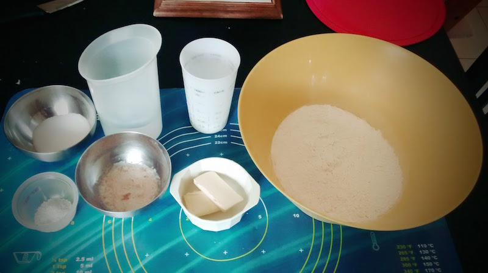
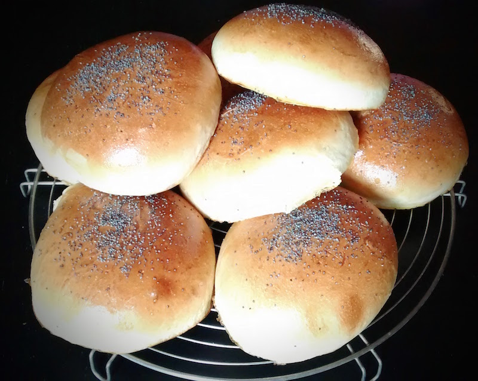
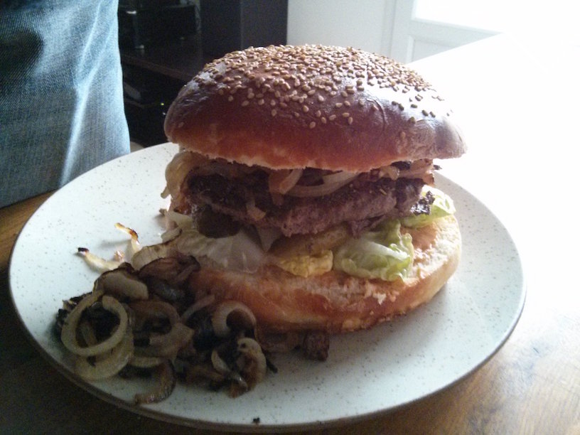
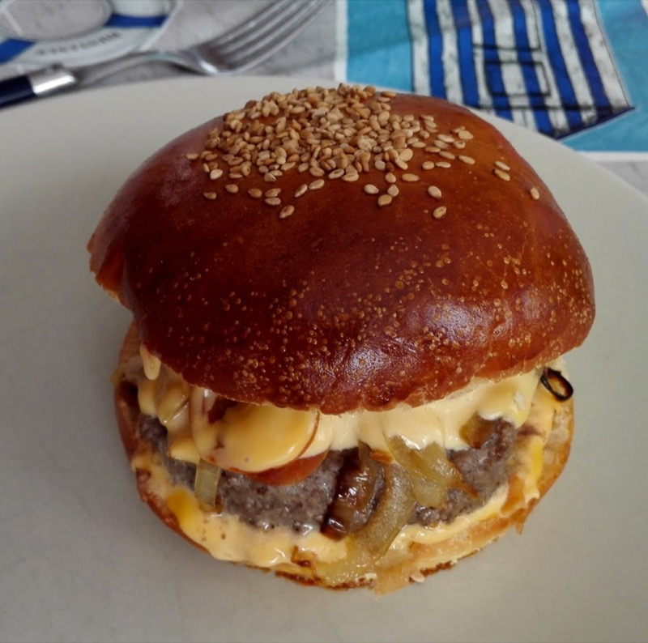

Buns
====

Recette pour 15-16 pains à hamburger. Il est aisé de la diviser par 2 si besoin de plus petites quantités.

Ingrédients
-----------

- 1 kg de farine T65
- levure 30g fraiche ou 10g (un peu plus d'un sachet) de levure déshydratée (pas de levure chimique)
- 20g de sel
- 50g de sucre
- 400ml d'eau tiède
- 150ml de lait tiède
- 2 oeufs
- 60g de beurre pomade

Réalisation
-----------

### Levure

- Mélanger la levure dans 2-3 cuillères à soupe de lait tiède
- Attendre 5-10 minutes

### Première pousse

Dans un grand saladier :

- mélanger la farine, le sel et le sucre
- creuser un puit, verser la levure, l'eau, le lait et les oeufs battus
- mélanger jusqu'à avoir une pâte qui commence à être consistante

Verser la pâte sur le plan de travail fariné :

- travailler la pâte jusqu'à ce qu'elle prenne un peu de corps et soit homogène
- incorporer le beurre en plusieurs fois en l'intégrant à chaque fois
- pétrire une dizaine de minutes, elle doit devenir légèrement adhérente mais pas collante
- si besoin rajouter de l'eau ou de la farine (fonction de la taille de vos oeufs entre autre)

Prendre un saladier légèrement huilé :

- placer la pâte en boule dans le saladier
- couvrir avec du film
- laisser lever 1h30 à 2h, jusqu'à ce que la pâte double de volume

### Deuxième pousse

- verser la pâte sur le plan de travail légèrement huilé
- replier la pâte quelques fois sur elle-même
- diviser la pâte en 16 boules (env 110-120g chacune)
- les couvrir avec un torchon
- poser pendant 5 minutes
- déposer les boules sur des plaques de cuissons recouvertes de papier sulfurisé
    - bien espacer les boules (5-6 cm entre chaque)
    - aplatir délicatement mais fermement les boules (par exemple en utilisant un morceau de papier sulfurisé huilé)
    - couvrir d'un torchon
- laisser lever 1h-1h30

### Cuisson

Four préchauffé à 200°C

- dorer les buns avec un oeuf battu avec un peu d'eau
- parsemer de sésame, pavot, sel, rien, etc
- cuire 12-15 minutes : ils doivent être bien gonflés, bien dorés
- refroidir sur une grille

### Conservation

Si vous ne les utilisez pas tout de suite, vous pouvez les congeler une fois tranchés.

### Résultats

_(par un collègue de chez [Hexo+](https://hexoplus.com/))_

_[source](http://sandrakavital.blogspot.fr/2010/07/un-hamburger-parfait-commence-avec-un.html)_

_(par [Bob Maerten](https://bobmaerten.eu/))_

