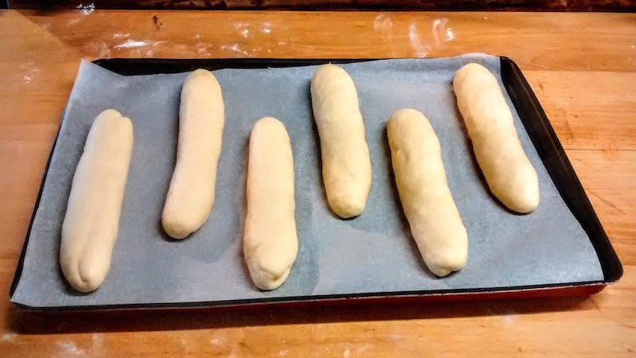

Pains à Hot Dog
===============

Recette pour une douzaine de pains à hot dog. L'avantage de ces pains, légèrement briochés, est qu'ils retiennent très bien toutes les sauces. Vous pouvez donc charger vos hot dog sans que cela vous coule dessus !

Ingrédients
-----------

- 850g de farine T65
- 2 sachets de levure de boulanger déshydratée
- 1,5 cc de sel
- 2 cs de sucre
- 1 œuf + 1 jaune
- 30g de beurre mou en morceaux
- 250ml de lait
- 240ml d'eau
- 1 blanc d'œuf + 1 cs d'eau, graines de pavot, sésame, etc. pour le glaçage

Réalisation
-----------

### Première pousse

Dans un grand saladier :

- mélanger la farine, la levure, le sel et le sucre
- creuser un puit, ajouter l'œuf et le jaune, le lait et le beurre ramolli
- mélanger progressivement et ajouter petit à petit l'eau : il n'est pas nécessaire de tout mettre suivant votre farine et la taille de vos œufs (j'ai de très gros œufs, je n'ai mis qu'environ 200ml)

Une fois que la pâte se décolle bien des parois, la verser sur le plan de travail fariné et pétrir une dizaine de minutes.

Prendre un saladier légèrement fariné :

- placer la pâte en boule dans le saladier
- couvrir avec un linge humide
- laisser lever environ 1h

### Deuxième pousse

- dégazer la pâte avec la paume
- verser la pâte sur le plan de travail légèrement fariné
- peser votre pâte et la diviser en 12 boules (environ 120g)
- couvrir et laisser reposer 5 minutes
- façonner les morceaux en boudins allongés d'environ 10 à 12 cm
- les poser sur une plaque recouverte d'un papier sulfurisé en les espaçant
- couvrir d'un torchon
- laisser lever 45 minutes à 1 heure

### Cuisson

Four préchauffé à 180°C

- badigeonner les pains avec le blanc d'œuf allongé d'eau
- parsemer de sésame, pavot, etc
- cuire environ 15 minutes jusqu'à avoir un beau blond doré
- refroidir sur une grille

### Conservation

Si vous ne les utilisez pas tout de suite, vous pouvez les congeler une fois partiellement tranchés.

_[source](http://sandrakavital.blogspot.fr/2006/08/hot-dog-buns.html)_
