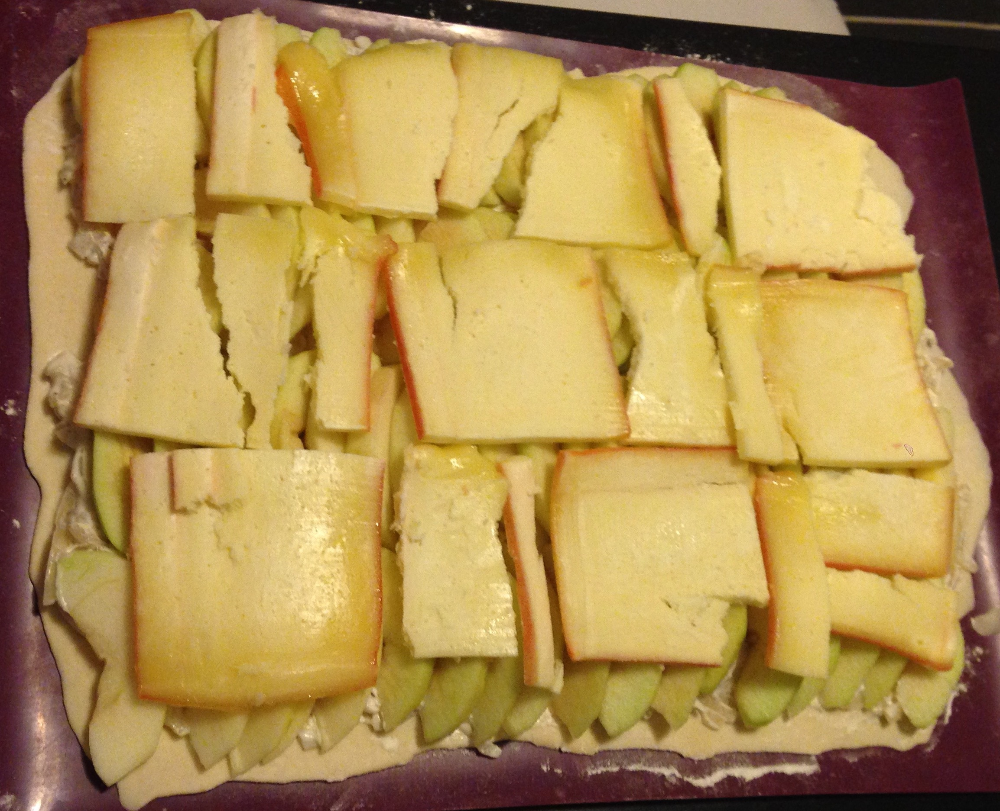

# Pizza pommes raclette
----------------------------------------------------

Recette pour 1 pizza (2.5 personnes).

## Ingrédients

- 3-4 oignons
- 1 noisette de beurre
- 5 cl de cognac
- 3 grosses c.à.s de crème frèche épaisse
- 4 pommes granny smith
- 6-8 tranches de raclette
- Pâte à pizza

## Réalisation

- Emincer les oignons (3-4) en cube et les faire revenir dans du beurre (1 noisette).
- Une fois blanchis, ajouter le cognac (5cl), sel et poivre.
- Laisser mijoter, puis ajouter la crème fraiche épaisse (3 grosses c.à.s).
- Etaler la pâte à pizza (faite maison ou pas).
- Etaler l'émincé d'oignons.
- Etaler les pommes (4 granny smith) pelées et coupées en tranches (façon tarte aux pommes).
- Déposer les tranches de raclette (6-8) par-dessus.
- Enfourner dans un four préchauffé à 200°C.

- Déguster bien chaud.

## Trucs et astuces
- Bien garnir en pommes.
- Encore meilleur avec de la raclette fumée.
