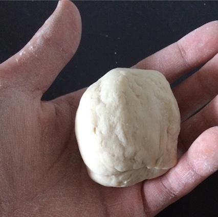
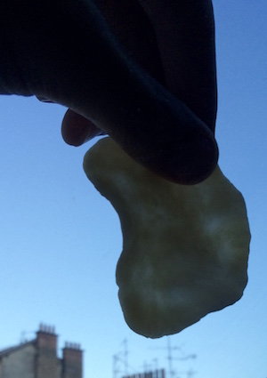
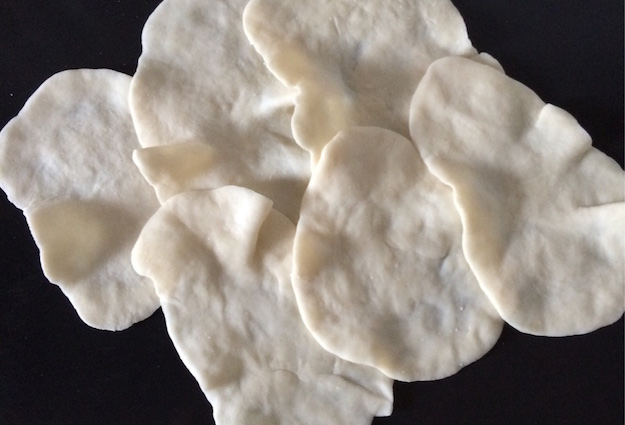
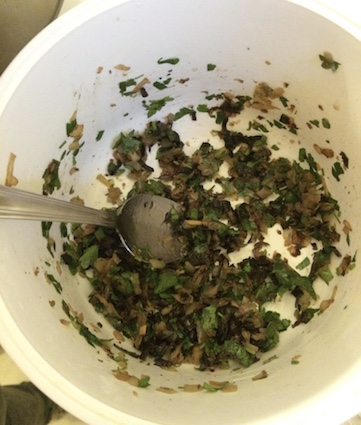
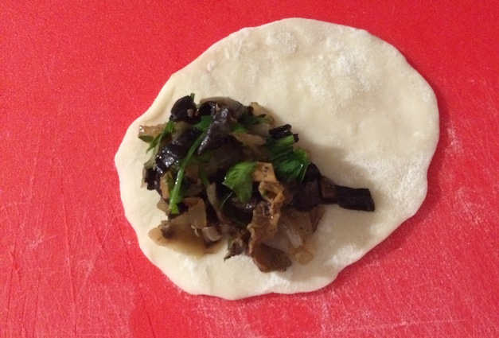
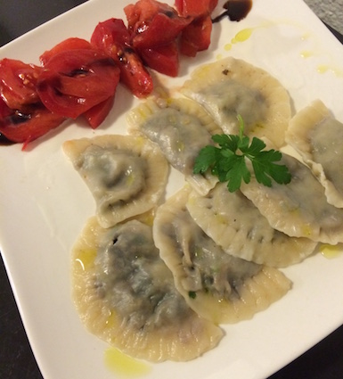

Raviolis farcis
===============

Recette pour 16 raviolis ou 2 personnes.
Attention, la formation des pâtes peut prendre du temps.

Ingrédients
-----------

Pâtes :

- 100g de farine T65
- De l'eau
- une pincée de sel

Farce :

- Un poingée de champignons deshydratés : trompettes chanterelles et de mort.
- Un petit bouquet de persil frais
- 80g d'oignon jaune (un demi)
- 50g de fromage type Comté

Réalisation
-----------

### Pâtes

- Versez la farine avec une pincée de sel dans un cul-de-poule.
- Ajoutez une petite quantité d'eau et mélangez.
- Recommencez jusqu'à obtention d'une boule de pâte ni sèche ni collante.

- Prenez de petis bouts de la boule et formez-les en fines galettes.
- Regardez la pâte devant une source de lumière pour garantir une finesse
  homogène, sans quoi la cuisson pourrait être irrégulière.
- Jetez les galettes au fur et à mesure dans le cul-de-poule que vous aurez
  préalablement tapissé de farine. Cela évitera que les galettes ne se collent
entre elles.

### Farce

- Rafraîchissez les champignons dans un récipient avec un peu d'eau.
- Émincez l'oignon.
- Faîtes-le suer dans une poêle.
- Déglacez avec l'eau des champignons.
- Émincez grossièrement le persil et les champignons, un peu plus finement le
  fromage.
- Versez oignons, persil, champignons et fromage dans un récipient.
- Salez, poivrez.

- Aplattissez le contour des galettes de moitié.
- Humidifiez le contour avec un pinceau.
- Posez de la farce sur la galette.
- Refermez et soudez par pression avec une fourchette.

### Cuisson

Dans une grande casserolle d'eau bouillante :

 - Jetez les pâtes.
 - Attendez au moins 3 minutes.
 - Goûtez un bord de pâte épais pour jauger la cuisson.
 - Égouttez quand c'est cuit.
 - Servir avec un trait d'huile d'olive.

À manger sans attendre.

